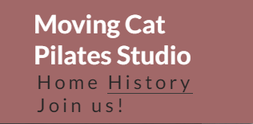
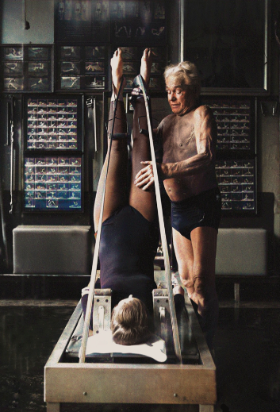

# **Moving Cat Pilates Studio**
## **Introduction**
The Moving Cat Pilates Studio, is a fictional Pilates Studio that I have created a website for to help inform people about the history of Pilates and how it first came about and how, at the Moving Cat Pilates Studio’s around the UK, all the MC Pilates instructors, or the Elders, have been taught to the standards of Joseph Pilates who invented the Pilates moves back in the first world war helping injured soldiers. Aswell as being a club to join, via the join us page, and offering fixed classes and one-two-one sessions, the website includes a history page with a link to an informative animated video which tells the story of Pilates. It is targeted at a wide audience as Pilates is available for anyone at any level, from beginner to advanced. We offer a free taster session prior to joining so that the user can be sure it is something they would like to join and is important to introduce people who may not have done Pilates before and it can be quite a commitment to join a club without trying it first. 

## **My starting website features**
### **Header**
The Moving Cat Pilates Studio, is a fictional Pilates Studio that I have created a website for to help inform people about the history of Pilates and how it first came about and how, at the Moving Cat Pilates Studio’s around the UK, all the MC Pilates instructors, or the Elders, have been taught to the standards of Joseph Pilates who invented the Pilates moves back in the first world war helping injured soldiers. Aswell as being a club to join, via the join us page, and offering fixed classes and one-two-one sessions, the website includes a history page with a link to an informative animated video which tells the story of Pilates. It is targeted at a wide audience as Pilates is available for anyone at any level, from beginner to advanced. We offer a free taster session prior to joining so that the user can be sure it is something they would like to join and is important to introduce people who may not have done Pilates before and it can be quite a commitment to join a club without trying it first.

Header at 320px width

Header at 768px width

Header at 1024px width

Background colour used rbg (161, 104, 104). I choose this as a nice earthy colour that fits the kind of colour scheme you would expect for a Pilates type of website. A calming colour that fits in with the other images throughout the website.
I have used the same colour in the footer as the background to match the header.

The Nav bar links to my other pages. The History page and the Join Us page.
This is in the same place on each page for consistency and makes it easy for the user to navigate from each page in the same way.

**Index/Home page image**

I have included a background image of a silhouette of someone performing a well-known Salutation pose which will let people know straight away that the site is related to the Pilates/Yoga type industry. The colours and image give this calming effect also.

There is cover text overlaid on top of the image with a background effect to help the words stand out. Although the words on the home page would stand out ok against the background where it is positioned, I have included the background colour to match the History and Join Us pages which also have cover text and need the background colour to make the text stand out enough.
The cover text is a quote from Joseh Pilates, the founder of Pilates. I have put a quote from Joseh Pilates on each of the pages for consistency and to give the end user an interesting quote to read on each page to keep them interested.

Home page background image with cover text on smaller screens

Home page background image with cover text on larger screens

**Who are we section**

Underneath the salutation image is a section with information about the club. The user will learn the locations of the studios and be interested to know that they can learn some of the history of Pilates by navigating to the History page. 
The background colour used here is rgba (161, 104, 104, 0.6) to give the same tone as the header and footer but lighter so that the black text stands out better and matches the tone of the header and footer colour.

Who Section on smaller screens

Who section on larger screens

**Times table section**

In this section users are given the times that are held in the studios around the UK.
I have used a calming background image with colours that go well with the background colour that is used in the header and footer and the who section above.

Timestable on smaller screens

Timestable on large screens

**The Footer**

The footer includes links to the common social media pages that are important to the users. These links all open new pages so as not to take the user away from the Moving Cat website page. As mentioned, the background colour here matches the header and the social media icons are in white to stand out and match the text colour in the header for consistency and appealing aesthetics.

Footer on smaller screens

Footer on larger screens

History Page

Users are reminded on the home page to navigate to the History page to find out more about Joseph Pilates, the founder of Pilates moves.

 This page contains a background image with some cover text which is again a quote from Joseph Plates. This shows consistency throughout the website as the user navigates from page to page, they see the same layout which keeps things easier to take notice of. The image is a swirling pattern, giving the end user a relaxing feeling and again the colours of this image work well with the colours in the heading and of the background section below in the ‘what’ section.

History page background image smaller screens

History page background image larger screens

**The What section**

Here is a blurb about how Pilates was first developed and contains a link to a short, animated film about the history of Joseph Pilates. The user neds to click on the name Joseph Pilates which I have turned into a link to take you to a new page where the YouTube video is played.

Also an image of Joseph Pilates using one of his pieces of equipment back in the 1920's.

This is an informative page for the users, to let them know the history of the classes they will be signing up for and how Pilates is also very beneficial towards health and flexibility.

**The Join us page**

The final page to navigate to, is the join us page where users can sign up for a free taster session. There is an image of a beautiful sunset, where the user can imagine they are doing Pilates, and again another quote from Joseph Pilates is written as cover text over the image.

Join us page image on smaller screens

Join Us page image on larger screens

Underneath this image on smaller screens, is the form to fill out with full name and email address, choose which location the user is in and which class time the user would like for their free taster session.
On larger screens this is to the side of the image.

Form section on smaller screens

Form section on larger screens

**Future Features**

**Testing**

I have tested that the navigation bar works on all screens and that clicking on the Moving Cat Pilates Studio header on any screen takes you back to the home page as it should. All the links in the footer work on every page and take you to the sign-up page for each of the social media sites. I have checked the links on each page.
On the History page there is a link to an informative video on YouTube.
I have tested the form page. As this is my first project, this is not set up to actual collect the data however the fields can be filled in and submitted, then when the page is refreshed the information is cleared.
If you try to submit the form without entering all the required information, a warning message is seen.

Message if you don't select a location

Message if you don't select a class time

Message if you don't fill out the name fields

Message if you don't write an email address in the email input box

The Let's Join button at the bottom of the form changes color when the user hovers over it.

Before mouse hover over button

With mouse hover over button

I have checked that all my pages are responsive on-screen sizes:
320px, 425px, 768px, 1024px, 1440px and 2560px

I have checked them in Enterprise and Firefox browsers as well as the Google brower I use myself.

HTML Validator testing

CSS Validator testing

Unfixed Bugs

Deployment

Credits

